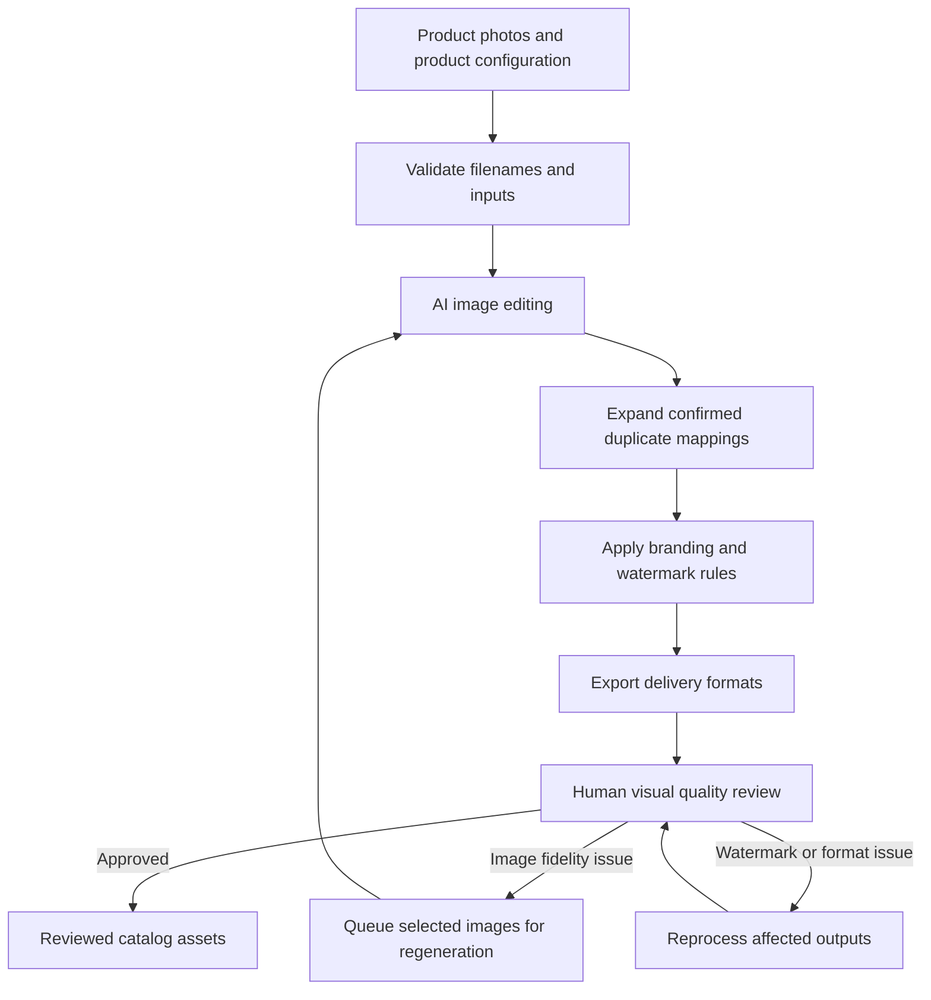

# Elyon Industrial — AI Product Image Production Pipeline

**Client case study · Creative production automation · Python · Generative AI · Human quality review**

I built a Python-based image production workflow for Elyon Industrial to turn product photos into consistent, branded catalog assets. The system connects AI image editing with product-specific instructions, logo placement, watermarks, format conversion, progress tracking, and visual quality control.

The project grew out of a real client production task: preparing the product images from a photography shoot for the company's catalog and website.

This repository documents the project and its design decisions. It contains a case study and reusable writing context; the production scripts and client image library are maintained separately.

## The problem

Preparing industrial product images involves more than removing a background. Each output must remain recognizable as the exact product being sold, including its terminals, controls, colors, labels, and proportions.

Every image also needs the right identity and angle in its filename, consistent branding, the required delivery formats, and a way to review and correct errors. Repeating these operations manually across a catalog creates opportunities for mismatched files and inconsistent outputs.

I needed a repeatable process that could handle routine production work while keeping visual judgment in the review loop.

## What I built

| Component | Purpose |
|---|---|
| Product and view configuration | Stores product descriptions, cleanup instructions, and angle-specific details by brand |
| Source validation | Checks filename conventions and expected inputs before generation |
| AI image editing | Uses source photos and structured prompts to request clean, white-background catalog images |
| Branding | Applies the Elyon corner logo and a diagonal watermark intended to stay on the product |
| Format delivery | Creates source-format, mixed PNG/WebP, and all-WebP versions, with and without the diagonal watermark |
| Progress and recovery | Tracks brand status and supports resuming work while skipping existing outputs |
| Visual QC | Presents source and final images together for human approval or rejection |
| Targeted corrections | Routes selected defects to regeneration or downstream processing and creates follow-up review reports |

## How it works

The diagram summarizes the production process. Some recovery steps require an operator to launch the next command or interpret a review comment.

## Decisions that mattered

**Keep product context separate from processing code.** Brand modules define what each product and view should preserve. The common stages handle generation, branding, conversion, and review.

**Use deterministic code for repeatable image operations.** Logos, watermarks, filenames, and exports follow explicit rules. Generative image editing handles the visual cleanup request.

**Review fidelity as well as appearance.** A polished image can still contain the wrong terminal count, altered controls, or incorrect text. The QC interface makes the source image available for comparison.

**Make corrections selective.** A generation defect affects every version derived from that image. A downstream defect can often be corrected closer to the affected stage. The recovery process distinguishes those cases.

**Treat exceptions as part of production.** Thin cables, product variants, reused photographs, and inconsistent folder names required explicit handling and documented lessons.

## Technology

| Technology | Role in the original implementation |
|---|---|
| Python | Orchestration, product configuration, processing, and recovery tools |
| OpenAI image generation API | Direct source-image editing path |
| Playwright | Earlier browser-based generation path |
| Pillow and NumPy | Image compositing, conversion, and pixel operations |
| rembg | Product masking for standard watermark processing |
| HTML, CSS, and JavaScript | Local visual review interface |
| JSON | Saved state, generation settings, and review responses |
| openpyxl | Inventory workbook support in image sourcing tools |

## Results and impact

The project produced a reusable workflow for preparing Elyon's catalog images, with consistent delivery structures and a repeatable review-and-correction process. Routine image operations became scriptable, while the reviewer retained responsibility for product fidelity and exceptions.

The implementation supports multiple brands, interrupted runs, confirmed duplicate reuse, and selected-image regeneration. These are implemented capabilities, rather than a measured productivity benchmark. This case study does not claim a verified time saving, cost reduction, acceptance rate, or final catalog completion percentage.

## What I learned

Reliable creative automation depends on the system around generation: product identity, file conventions, review criteria, recovery behavior, and clear rules for exceptions. The first generated image is only one step in producing a usable client asset.

This project is an **AI-powered workflow with deterministic orchestration and human review**. The image output is generative, but the pipeline does not independently plan its work or decide how to investigate unfamiliar defects. It provides a practical foundation for a future agent that could use the existing scripts as tools.

## Read more

- [Full case study](CASE_STUDY.md): the business problem, implementation choices, and lessons from production.
- [Context for future posts](POST_CONTEXT.md): verified project facts, writing guidance, and a reusable prompt.
- [Evidence notes](EVIDENCE_NOTES.md): how the claims map to the original implementation.

*Klarissa Artavia · Data & AI Strategy | Automation & Analytics*
